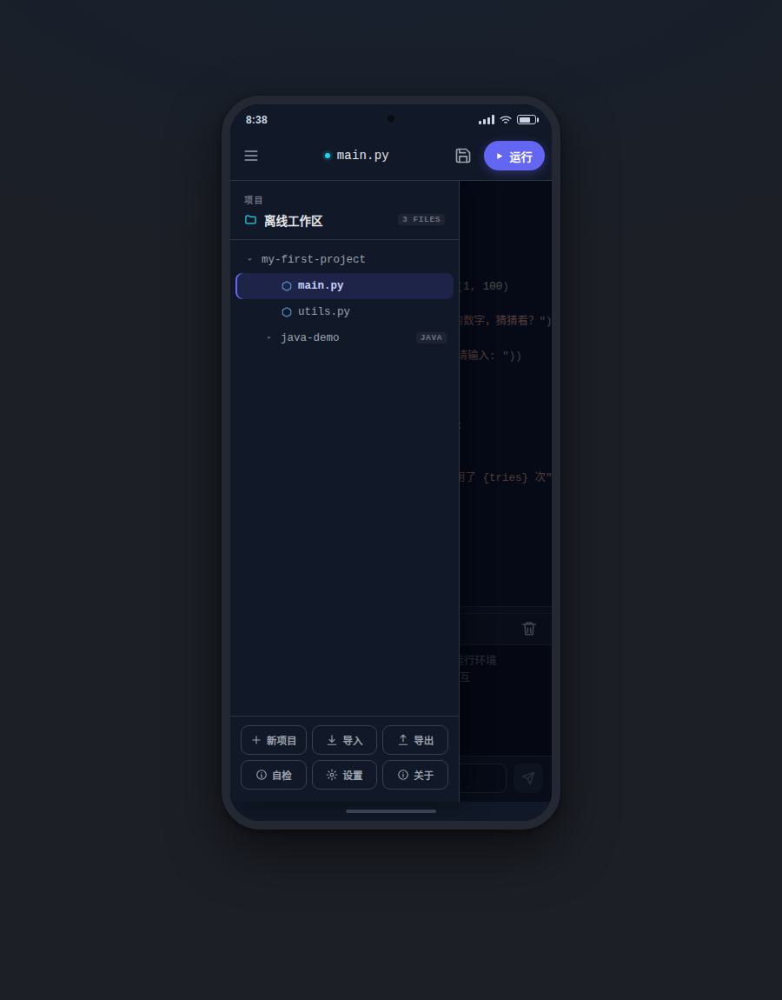

<h1 align="center">📱 DevTerminal</h1>

<p align="center">
  <b>完全离线的安卓编程终端 — 手机上的现代 IDE。<br>写、跑、调试 Python 与 Java，全程零网络。</b>
</p>

<p align="center">
  <a href="LICENSE"></a>
  <a href="https://developer.android.com"></a>
  <a href="https://kotlinlang.org"></a>
  
  
</p>

<p align="center">
  <a href="https://x33834.github.io/dev-terminal/"></a>
  <a href="https://github.com/x33834/dev-terminal/releases/latest"></a>
  <a href="https://github.com/Morningstar202604/dev-terminal"></a>
  <a href="https://gitcode.com/badhope/dev-terminal/releases"></a>
  <a href="https://gitee.com/badhope/dev-terminal"></a>
</p>

<p align="center"><b>开源仓库</b>（四平台并列，内容完全一致）：<a href="https://github.com/x33834/dev-terminal">GitHub/x33834</a> · <a href="https://github.com/Morningstar202604/dev-terminal">GitHub/Morningstar202604</a> · <a href="https://gitcode.com/badhope/dev-terminal">GitCode</a> · <a href="https://gitee.com/badhope/dev-terminal">Gitee</a></p>

<p align="center"><b>🌐 官网</b>（GitHub Pages 双号部署，内容一致）：<a href="https://x33834.github.io/dev-terminal/">x33834.github.io/dev-terminal</a> · <a href="https://morningstar202604.github.io/dev-terminal/">morningstar202604.github.io/dev-terminal</a></p>

**一个完全离线的安卓编程终端**：在手机上直接写、跑、调试 Python（首版）与 Java，界面是现代 IDE，而不是命令行的黑框。



## 与市面方案的区别

### 与已发布软件的完整功能对照（2026-09 核实）

| 功能 | Termux | Pydroid 3 | Acode | Spck | **DevTerminal** |
|---|---|---|---|---|---|
| 现代 IDE 界面 | ❌ 命令行 | ⚠️ 较旧 | ✅ | ✅ | ✅ |
| 多语言 | ✅ | ❌ 仅 Python | ✅ | ⚠️ Web 为主 | ✅ Python + Java |
| 完全离线运行 | ⚠️ 装包要联网 | ⚠️ 部分离线 | ⚠️ | ❌ | ✅ **零网络** |
| 快捷符号栏 | ❌ | ✅ | ✅ | ✅ | ✅ 26 键 + Tab/退格 |
| 多文件 Tab | — | ✅ | ✅ | ✅ | ✅ |
| 查找/替换 | grep | ✅ | ✅ 正则 | ✅ | ✅ 计数跳转 |
| 全局搜索 | — | ❌ | ✅ | ✅ | ✅ |
| Git 集成 | ✅ | ❌ | ✅ | ✅ | ✅ 状态/提交/推送 |
| AI 助手 | ❌ | ❌ | ✅ 云端 | ✅ 云端 | ✅ **本机 Ollama（离线）** |
| 双指缩放字号 | — | ✅ | ✅ | ✅ | ✅ |
| 输出分享 | ✅ | ✅ | ⚠️ | ✅ | ✅ |
| 开源 | ✅ GPLv3 | ❌ | ✅ MIT | ⚠️ 部分 | ✅ Apache-2.0 |
| 价格 | 免费 | 免费+广告 | 免费+广告 | 免费+内购 | **免费无广告** |

> 对标来源：各应用 Google Play / F-Droid 页面与其官方文档（2026-09 状态）。
> 我们的优势组合：**开源 + 无广告 + 完全离线运行 + 本机 AI**；差距项见下方 Roadmap。

### Roadmap（主动承认差距）

- [ ] 正则查找 / 大小写开关（Acode 已有）
- [ ] 编辑器主题选择（当前仅 darcula，Spck 有多主题）
- [ ] Markdown / HTML 实时预览（Spck 的核心卖点）
- [ ] 三态主题：跟随系统（当前深浅二选一）
- [ ] 逐字符 pty 输入（方向键 / Tab 补全，需要完整终端模拟）
- [ ] pip 离线包管理器（预装 wheel 缓存）

> **v0.2 对标升级**：UX 对齐 2026 年移动编程工具第一梯队（Pydroid 3 的扩展键盘、
> Spck 的 on-screen coding keys、Acode 的多 Tab 与查找替换、VS Code 的状态栏与会话恢复），
> 每一项都是为「手机上真的写代码」设计的，不是桌面功能的照搬。
>
> **v0.3 对标升级**：补齐 2026 年移动编程的「新四大件」——
> **命令面板**（Cursor 风格 ⌘K 动作搜索）、**Git 面板**（Spck 风格，调内置 git）、
> **AI 助手**（BYOK + 本地 Ollama 优先，Replit 风格）、**全局搜索 + 代码片段**（Acode 风格）。

## 架构

```
Compose UI 层        文件树 / 代码编辑器 / 输出面板 / 运行栏
      │
执行引擎层           TermuxEngine — 模拟 termux 环境变量，ProcessBuilder 起进程
      │              实时流式回调 stdout/stderr，带超时保护
离线工具链层         assets/usrtar.zip → 首次启动解压到 files/usr（零下载）
```

**设计取舍**：不自造终端模拟器（那是 termux 十年工程），改用 `ProcessBuilder` 直接拉起内置解释器；环境变量完全模拟 termux 布局，因此内置的 termux 预编译二进制可在 bionic 上正常运行。

## 目录结构

```
dev-terminal/
├── app/src/main/java/com/devterminal/
│   ├── MainActivity.kt                入口
│   ├── engine/
│   │   ├── EnvironmentInstaller.kt    离线工具链解压 + termux 环境变量
│   │   ├── EnvDiagnostics.kt          环境自检（真实探测每个工具）
│   │   ├── FriendlyError.kt           报错翻译成人话
│   │   ├── CompletionProvider.kt      静态补全词表 + 文档符号提取
│   │   ├── TermuxEngine.kt            执行引擎（流式输出 + stdin + Java 多文件编译）
│   │   ├── GitManager.kt              Git 操作（内置 git，v0.3）
│   │   ├── AiClient.kt                AI 客户端（OpenAI 兼容，v0.3）
│   │   ├── Snippets.kt                代码片段库（v0.3）
│   │   ├── ExecutionService.kt        前台服务保活（防 Android 12+ 杀进程）
│   │   ├── CrashLogger.kt             全局崩溃日志
│   │   ├── RunModels.kt               Language / RunRequest / RunEvent
│   │   └── SyntaxCheck.kt             开发期自检工具
│   ├── settings/
│   │   └── SettingsStore.kt           设置持久化（SharedPreferences）
│   ├── project/
│   │   ├── ProjectManager.kt          项目目录 / 文件树 / 读写 / 重命名
│   │   └── Templates.kt               6 个项目模板
│   └── ui/
│       ├── EditorScreen.kt            主界面 Scaffold + 各对话框
│       ├── EditorViewModel.kt         状态管理（Tab/查找/会话恢复）
│       ├── CodeEditorView.kt          SoraEditor 桥接（光标/插入/查找跳转）
│       ├── StaticCompletionLanguage.kt 补全语言包装器（委托高亮 + 静态补全）
│       ├── FileTabs.kt                顶部多文件 Tab 条（v0.2）
│       ├── SymbolBar.kt               快捷符号栏（v0.2）
│       ├── FindBar.kt                 查找 / 替换条（v0.2）
│       ├── StatusBar.kt               底部状态栏（v0.2）
│       ├── FileTree.kt                文件树（长按操作）
│       ├── OutputPanel.kt             输出面板 + 交互输入行
│       ├── CommandPalette.kt          命令面板 ⌘K（v0.3）
│       ├── GlobalSearch.kt            全局搜索（v0.3）
│       ├── GitPanel.kt                Git 面板（v0.3）
│       ├── AiPanel.kt                 AI 助手面板（v0.3）
│       └── theme/Theme.kt             Material 3 主题
├── design/mockup.html                 高保真可交互原型（浏览器直接打开）
├── tools/
│   ├── extract_bootstrap.sh           方式 A：真机 Termux 导出工具链
│   ├── build_offline_bundle.sh        方式 B：CI 交叉编译
│   └── selfcheck.py                   静态自检（无需 Android SDK）
└── app/build.gradle.kts
```

## 核心功能

### 1. 交互式 stdin（支持 `input()`）
输出面板下方有输入行，运行中的进程可接收键盘输入。
Python 的 `input()`、`raw_input()` 等阻塞式读取都能正常交互。

> 实现要点：引擎用 `-u` 启动 Python 关闭缓冲，否则输出会憋到进程结束才刷出。

### 2. Java 多文件编译
点「运行」时自动：
1. 递归收集项目内所有 `.java` 源文件
2. `javac -encoding UTF-8 -d build/classes` 一次性编译
3. 自动探测含 `static void main` 的类（支持 `package` 声明，拼出全限定名）
4. `java -cp build/classes <主类>` 运行

多个类互相调用、含包声明的项目都能直接跑。

### 3. Python 多模块导入
工作目录设为项目根，所以 `from utils import fib` 这类同目录导入开箱可用。

### 4. 6 个项目模板
| 模板 | 演示内容 |
|---|---|
| Python 空白项目 | 基础语法 |
| Python 交互输入 | `input()` 猜数字（练习 stdin） |
| Python 多模块 | `main.py` 导入 `utils.py` |
| Python 数据处理 | numpy 统计计算 |
| Java 控制台项目 | 单文件 Java |
| Java 多文件项目 | 多类协作 + 编译流程 |

### 5. 环境自检与友好报错

**自检**（抽屉 → 「环境自检」）：真实启动每个工具进程，逐项显示 Python / pip / Java / javac / Git
是否可用、版本号、占用空间。失败的项会说明原因（未安装 / 无执行权限 / 架构不匹配）。

**友好报错**：运行失败时自动把原始报错翻译成可操作的中文提示，覆盖 20+ 高频错误：

| 原始报错 | 提示 |
|---|---|
| `ModuleNotFoundError: No module named 'numpy'` | 缺模块「numpy」+ 说明离线环境要预装 |
| `IndentationError` | 缩进不一致，建议统一 4 空格 |
| `EOFError` | 程序在等输入但读到 EOF，用底部输入行 |
| `cannot find symbol` | Java 类名/方法名拼错或忘了 import |
| `Could not find or load main class` | 确认有 `public static void main` |
| `Exec format error` | 工具链 CPU 架构与本机不符 |
| `Killed` / `signal 9` | 被系统杀进程，去设电池无限制 |
| `No space left` | 存储不足，建议用轻量工具链 |

### 6. 运行配置

顶部调音图标可配置：

- **命令行参数**：支持引号，如 `--name "hello world" -v` → `["--name", "hello world", "-v"]`
- **Java 主类**：留空则自动探测含 `main` 方法的类（含 `package` 声明）

### 7. 文件管理

文件树**长按**任一文件/目录，可重命名或删除（删除需二次确认）。

### 8. 前台服务保活

运行代码时自动启动前台服务 + 低优先级通知，规避 Android 12+ 的进程清理；
跑完立即撤掉通知，不常驻状态栏。

### 9. 导入 / 导出（SAF）

抽屉 →「导入」/「导出」：

- **导入**：从手机任意位置选文件，复制进当前项目并自动打开
- **导出**：把当前编辑内容写到手机任意位置（默认用原文件名）

基于 Android Storage Access Framework，不需要存储权限，兼容 Android 10+ 分区存储。

### 10. 设置页

抽屉 →「设置」：

| 项 | 说明 |
|---|---|
| 深色主题 | 关掉用浅色配色，实时生效 |
| 切换文件时自动保存 | 防止忘保存丢改动 |
| 编辑器字号 | 10–24sp 滑杆调节 |
| 运行超时 | 10–600 秒，防止死循环耗电 |

配置存在 SharedPreferences，重启保留。

### 11. 代码补全（静态）

输入 ≥1 个字符即弹出候选，覆盖：

- **Python**：39 个关键字、32 个内置函数、13 个标准库、5 个预装第三方库（numpy/pandas/matplotlib/flask/requests）、模块常用方法，**外加从当前文件提取的函数/类/变量名**
- **Java**：41 个关键字、18 个常用类、各类常用方法，**外加本文件定义的类与方法**

> **为什么不用 LSP**：完整 language server 是独立进程 + JSON-RPC，手机上内存与启动开销都不划算。静态词表 + 文档符号提取覆盖日常场景，零进程开销，契合「离线 + 省电」定位。

### 12. 崩溃日志

全局未捕获异常自动写入 `files/crash.log`（含时间、线程、完整堆栈）。
这是给离线场景设计的：用户在手机上崩了没法连电脑看 logcat，有了它可以直接复制反馈。

### 13. 静态自检脚本

```bash
python3 tools/selfcheck.py
```

无 Android SDK 时也能跑，检查：花括号配平（正确处理字符串模板）、
Compose 图标 import 完整性、package 与目录一致性、未使用的 import。
当前状态：**24 个文件，0 错误 0 警告**。

### 14. 多文件 Tab 条（v0.2）

顶栏下方一排 Tab，点一下切文件，× 关闭——不用再走抽屉。
对标 VS Code / Acode。关闭当前 Tab 自动切到相邻文件。

### 15. 快捷符号栏（v0.2）

编辑器下方固定一排编程高频符号：
`⇥ ( ) [ ] { } : ; " ' = < > + - * / % _ # & | ! . , $ \` + 退格。

横向滚动，点击直接插入光标处（走编辑器撤销栈，可 Ctrl-Z 回退）。
灵感来自 Pydroid 3 的扩展键盘与 Spck 的 on-screen coding keys——
**手机键盘打符号要切两三层键盘，这是移动编程第一痛点**。

### 16. 查找 / 替换（v0.2）

顶栏 🔍 唤出：实时匹配计数（`2/5`）、上一个/下一个跳转（编辑器自动滚动定位）、
展开后支持单个替换与全部替换。对标 Acode 的 Search & Replace。

### 17. 会话恢复（v0.2）

杀掉 App 再打开，自动回到上次的现场：上次项目、打开的 Tab 列表、
正在编辑的文件。不再每次启动都回到默认项目。

### 18. 输出面板拖拽调高（v0.2）

输出面板上沿的把手可以上下拖（120–560dp），看完长报错不用再进输出区滚动；
松手后高度记忆在设置里，重启保留。

### 19. 底部状态栏（v0.2）

`Ln 12, Col 8 · Python · 452 字符 · ● 未保存`——VS Code 的标配信息条，
随时知道光标在哪、文件脏不脏。

### 20. 命令面板 ⌘K（v0.3）

顶栏命令图标唤出，**搜索一切**：运行、保存、Git、AI、全局搜索、设置、12 个代码片段
——所有功能一个输入框直达。移动端放不下 N 层菜单，「搜索式导航」是最省屏幕空间的
交互（Cursor / VS Code 的核心范式）。

### 21. Git 面板（v0.3）

直接调用**内置工具链里的 git 二进制**（零额外依赖、离线可用）：

- 状态：分支名、变更文件列表（`--porcelain`）、最近提交
- 动作：初始化（main）、全部暂存并提交、推送、拉取
- 配置：Git 身份与远程 URL（token 可内嵌，`-c` 参数注入不落盘）
- 报错翻译：`403`→检查令牌、`non-fast-forward`→先拉取再推送、`who are you`→填身份

对标 Spck 的 Git 工作流——在手机上完成「改代码 → commit → push」全流程。

### 22. AI 助手（v0.3，可选）

**BYOK + 本地端点优先**——2026 年移动端 AI 编程的主流形态：

- 默认端点：本机 **Ollama**（`http://127.0.0.1:11434/v1`），本地推理 = **离线可用**
- 兼容任何 OpenAI 协议端点（llama.cpp server / LM Studio / 云 API）
- 四个快捷动作：**解释此文件 / 修复运行错误 / 生成测试 / 加注释**
- 「修复运行错误」会把最近一次运行的报错输出自动拼进上下文
- 上下文自动携带当前文件（截断 3500 字符防 token 爆炸）

> App 本体功能完全离线；AI 是可选功能，不配置端点就不发起任何网络请求。

### 23. 全局搜索（v0.3）

跨文件搜索所有 `.py / .java / .txt / .md / .json / .xml`，显示「文件 · 行号 + 命中行」，
点击直达。输入防抖 400ms，结果上限 200 条防卡顿。对标 Acode 的 project-wide search。

### 24. 代码片段库（v0.3）

12 个「手写麻烦、复用率高」的骨架代码（Python 主入口 / 类 / dataclass / 装饰器，
Java POJO / Stream / 正则等），从命令面板插入到光标处。

## UI 原型

`design/mockup.html` 是一个**可直接双击打开**的高保真原型，用纯 HTML/CSS/JS 实现：

- 真机外框 + 模拟状态栏
- 抽屉式文件树（可展开/折叠/切换文件）
- 真实语法高亮的代码编辑器（Python + Java 两套词法分析）
- 打字机效果的输出面板
- 可交互的输入行（真的能玩猜数字）
- 状态徽标变色、清空输出、保存提示

改 UI 前先在这里看效果，确认后再落到 Kotlin 代码。


## 构建步骤

### 1. 准备离线工具链（关键，决定「完全离线」）

**方式 A（推荐，最省事）**：在手机 Termux 里执行 `tools/extract_bootstrap.sh`，
产出 `usrtar.zip`，拷到 `app/src/main/assets/usrtar.zip`。

**方式 B**：在 Linux/CI 跑 `tools/build_offline_bundle.sh`，用官方容器构建 bootstrap。

> 没有这一步，App 能启动但显示「未找到内置工具链」，不会崩溃。

### 2. 补齐 SoraEditor 的语法配置

从 [sora-editor](https://github.com/Rosemoe/sora-editor) 仓库的 `language-textmate`
模块复制 `languages.json`、语法文件与主题到：

```
app/src/main/assets/textmate/
├── languages.json
├── themes/darcula.json
└── syntaxes/*.json
```

缺失时编辑器退化为纯文本（不崩）。

### 3. 构建 APK

```bash
cd dev-terminal
./gradlew assembleDebug        # 产物：app/build/outputs/apk/debug/app-debug.apk
```

要求：JDK 17+、Android SDK（`compileSdk 34`）。首次构建会下载 Gradle 与依赖，需联网；
**构建完成后，App 运行时不联网**。

### 4. 真机验证

```bash
adb install -r app/build/outputs/apk/debug/app-debug.apk
```

启动后应看到：环境就绪提示 → 默认 Python 项目 → 点 ▶ 运行 → 输出面板出现结果。

## 里程碑

| 阶段 | 内容 | 状态 |
|---|---|---|
| M1 | Gradle 工程 + Compose 外壳 | ✅ |
| M2 | 离线执行引擎（流式输出） | ✅ |
| M3 | 内置离线 Python 工具链 | ✅ |
| M4 | Java 多文件编译 + 运行 | ✅ |
| M5 | 交互式 stdin（`input()` 可用） | ✅ |
| M6 | 环境自检 + 友好报错 + 运行配置 + 文件管理 + 前台服务 | ✅ |
| M7 | SAF 导入 / 导出 | ✅ |
| M8 | 设置页 + 主题切换 | ✅ |
| M9 | 静态代码补全 + 崩溃日志 + 自检脚本 | ✅ |
| M10 | 体验对标版：Tab 页 / 符号栏 / 查找替换 / 状态栏 / 会话恢复 / 输出拖高 | ✅ |
| M11 | 2026 全家桶：命令面板 ⌘K / Git 面板 / AI 助手（BYOK）/ 全局搜索 / 代码片段 | ✅ |
| M12 | **真实构建出 APK**：国内镜像全链路（腾讯 Gradle/SDK + 阿里云 Maven）+ 内置 28MB 工具链 + 18 语言语法，沙盒内 assembleDebug 成功 | ✅ |

## 已知限制

- **APK 体积**：v0.3.0 debug 包实测 **47MB**（含 28MB 离线 Python 3.14 工具链与
  18 种语言语法高亮资源），不需要外部存储/下载器。不适合走 Google Play（前台服务
  specialUse 声明繁琐），建议 F-Droid / GitCode Releases / 官网直下。
- **Java 仅命令行**：Android 无 X11，OpenJDK 为 headless，无 Swing/JavaFX。
- **输入行为整行提交**：stdin 按行写入（模拟回车），暂不支持逐字符输入、方向键、
  Tab 补全等终端特性——需要完整 pty。
- **补全为静态词表**：不做语义分析，因此不能补全 `obj.` 之后的成员（需要 LSP 或类型推断）。
- **复制 / 粘贴**：编辑器本身依赖系统剪贴板，长按菜单由 SoraEditor 提供。
- **前台服务为 specialUse 类型**：上架 Google Play 需额外声明用途说明。
- ~~沙盒无法出 APK~~：**已解决**。通过国内镜像（腾讯 Gradle/SDK + 阿里云 Maven）
  在纯 Linux 沙盒内真实构建成功，详见下方「镜像构建指南」。

## 许可证

- 本项目代码：**Apache License 2.0**，见 [LICENSE](LICENSE)。
- 第三方组件声明（SoraEditor LGPL-2.1、内置工具链等）：见 [NOTICE.md](NOTICE.md)。

## 参与贡献

欢迎 Issue / PR：

1. Fork 本仓库，从 `main` 拉分支
2. 改动 Kotlin 代码后请先跑 `python3 tools/selfcheck.py`（0 错误 0 警告再提交）
3. UI 改动请先在 `design/mockup.html` 原型里验证效果
4. Commit 信息用祈使句，如 `Fix stdin deadlock in TermuxEngine`

## 镜像构建指南（无 Android SDK 也能出包）

本项目已在 **无 Android SDK 的纯 Linux 沙盒** 内真实构建出 APK（v0.3.0，47MB）。
构建全程使用国内镜像，无需访问 Google 服务器：

| 组件 | 镜像 |
|---|---|
| Gradle 8.9 发行包 | `mirrors.cloud.tencent.com/gradle/`（gradle-wrapper.properties 已指向） |
| AGP / AndroidX / SoraEditor | `maven.aliyun.com/repository/google` + `/public`（settings.gradle.kts 已配置） |
| Android SDK platform-34 / build-tools 34 | `mirrors.cloud.tencent.com/AndroidSDK/` |
| aapt2 / d8 / apksigner | build-tools 内置 Linux x86_64 可执行文件，直接可用 |

离线工具链 `app/src/main/assets/usrtar.zip`（28MB，Python 3.14.6 + bash + coreutils +
curl + tar 等 1745 个文件）与 `assets/textmate/`（18 种语言语法）**已随仓库提供**，
clone 后无需任何额外步骤即可构建。

```bash
# 三行出包（JDK 17+，SDK 位置由 local.properties 的 sdk.dir 指定）
./gradlew assembleDebug          # 产物：app/build/outputs/apk/debug/app-debug.apk
```

真机安装后首次启动自动解压工具链（全程不联网），▶ 运行 `print("hello")` 即验证。
